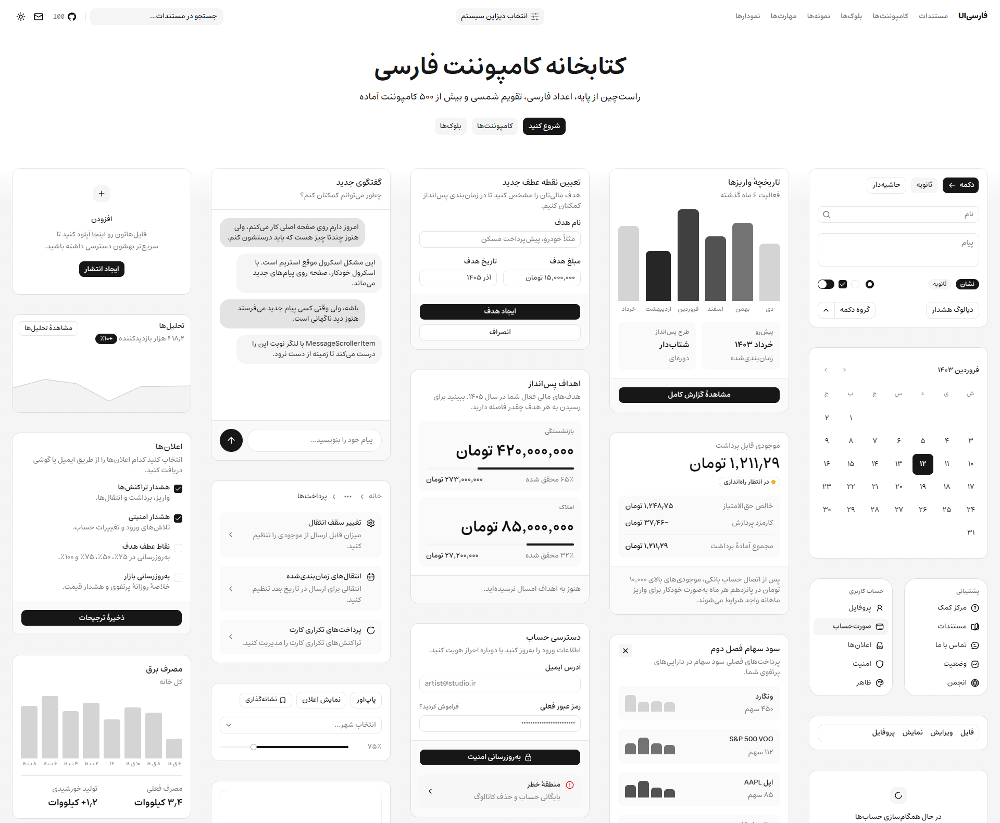

[](https://wakatime.com/badge/user/aa8c2b32-33c3-43c1-887e-5ded05b7dcea/project/7e8b0abe-5cd2-44a5-a05e-2e2114d749bd)

# FarsiUI 

[Website](https://farsiui.ir) · [Docs](https://farsiui.ir/docs) · [Components](https://farsiui.ir/docs/components) · [Blocks](https://farsiui.ir/blocks) · [Demos](https://farsiui.ir/demos)

**A Persian-first UI component library and design system for React + Tailwind.**

Building a Persian product is more than flipping an English UI to RTL and pasting Farsi text. Numbers, dates, forms, typography, and interaction details need to be designed for Persian from the start. FarsiUI is built for that.

Components are added to your project with a CLI. You get the source, you own it, and you can change anything.



## Features

- **RTL-first:** layout, spacing, and controls designed for right-to-left
- **Persian-ready:** typography, Persian digits, and natural Farsi UI patterns
- **Jalali calendar:** Shamsi date support in date components
- **+500 components:** ready-to-use building blocks for product UIs
- **6 design systems:** switchable looks for docs and previews
- **Your code:** no locked runtime; copy, edit, and ship
- **shadcn-compatible:** same CLI / registry mental model
- **Accessible:** Base UI, Radix, and React Aria patterns

## Quick start

```bash
npx farsiui@latest init
npx farsiui@latest add button
```

```tsx
import { Button } from "@/components/ui/button"

export function Example() {
  return <Button>ادامه</Button>
}
```

Full guide: [Installation](https://farsiui.ir/docs/installation)

## Repository structure

This is a pnpm monorepo.

| Path | What it is |
| --- | --- |
| `apps/v4` | Main Next.js app: docs, component registry, blocks, demos |
| `packages/shadcn` | The `farsiui` CLI published on npm |
| `packages/react` | Shared React primitives used by the registry |
| `packages/helpers` | Shared utilities |
| `templates/` | Starter templates for new apps |
| `skills/` | Agent skills for Persian / RTL workflows |

Most day-to-day work happens in `apps/v4`.

## Local development

**Requirements:** Node.js 20+ and [pnpm](https://pnpm.io)

```bash
git clone https://github.com/MiladJoodi/FarsiUI.git
cd FarsiUI
pnpm install
pnpm v4:dev
```

Then open [http://localhost:4000](http://localhost:4000).

| Command | Description |
| --- | --- |
| `pnpm v4:dev` | Start the docs site (port 4000) |
| `pnpm v4:build` | Production build for the site |
| `pnpm registry:build` | Rebuild installable registry output |
| `pnpm farsiui:dev` | Run the CLI package in watch mode |
| `pnpm lint` | Lint the monorepo |

> Prefer a fast local disk for `apps/v4/.next`. Network or slow drives make cold starts much slower.

## Contributing

Bug reports, missing components, RTL issues, and PRs all help. See [CONTRIBUTING.md](./CONTRIBUTING.md).

If you want to contribute code:

```bash
pnpm install
pnpm v4:dev
```

Open a PR against `main` when ready.

## Credits

FarsiUI follows the [shadcn/ui](https://ui.shadcn.com) model: copyable components, CLI install, and registry-based delivery, adapted for Persian and RTL-first products.

## License

[MIT](./LICENSE.md)
